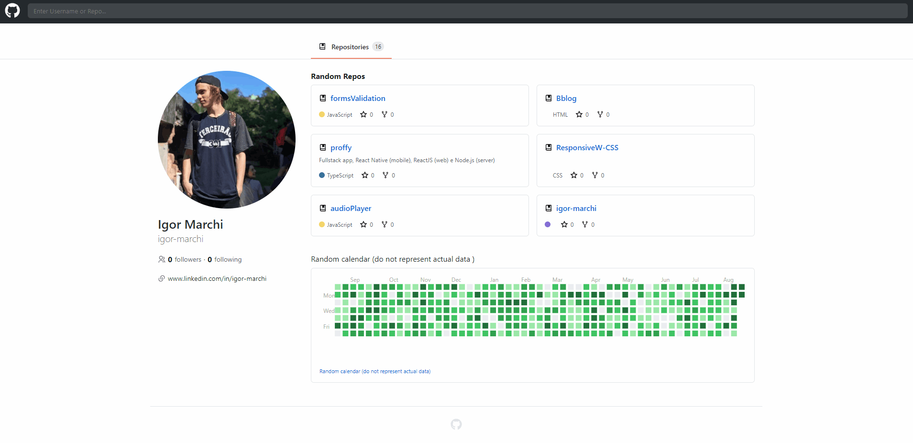
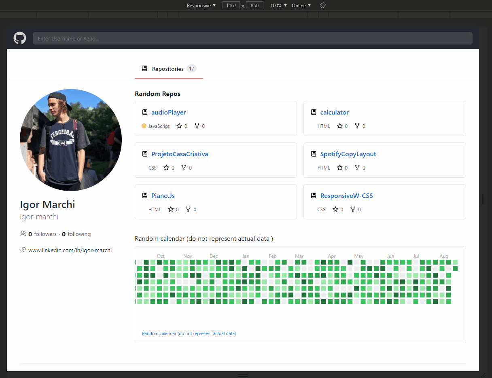

<h1 align="center">
    GitHub Clone
    <br>
</h1>
<h4 align="center">
  Um clone da interface do GitHub com o DarkTheme que está faltando 
</h4>
<h4 align="center">
  A clone of the GitHub interface with DarkTheme
</h4>
<p align="center">
  <a href="#rocket-technologies">Technologies</a>&nbsp;&nbsp;&nbsp;|&nbsp;&nbsp;&nbsp;
  <a href="#information_source-how-to-use">How To Use</a>&nbsp;&nbsp;&nbsp;|&nbsp;&nbsp;&nbsp;
  <a href="#memo-license">License</a>
</p>

<p align="center">
  
</p>

<br/>

<p align="center">
  
</p>

## :rocket: Technologies

This project was developed with the following technologies:

- [ReactJS](https://pt-br.reactjs.org/)

```bash
  #API's
```

- [GitHub API](https://developer.github.com/v3/repos/)

## :information_source: How To Use

To clone and run this application, you'll need [Git](https://git-scm.com), [Node.js v10.16][nodejs] or higher + [Yarn v1.13][yarn] or higher installed on your computer. From your command line:

```bash
# Clone this repository
$ git clone https://github.com/igor-marchi/gitHubClone gitHubClone
# Go into the repository
$ cd gitHubClone
# Install dependencies
$ npm install
# Start project (you need a mobile simulator)
$ yarn or npm start
```

## :memo: License

This project is under the MIT license. See the [LICENSE](https://github.com/igor-marchi/gitHubclone/blob/master/LICENSE) for more information.

Made with :purple_heart: [Igor Marchi](https://www.linkedin.com/in/igor-marchi/) :laughing:
